## 1. Project

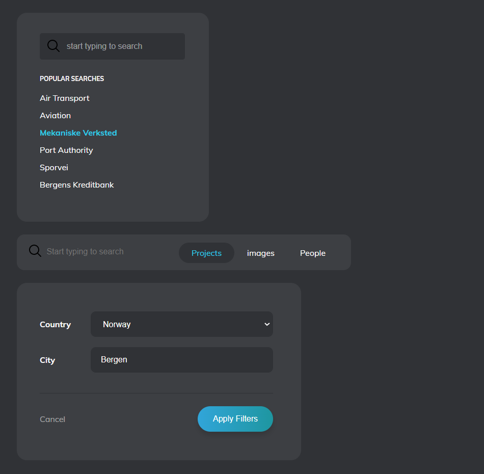

---

## 2. Project

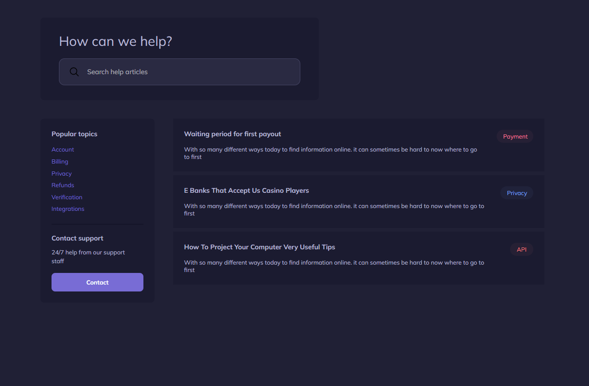

---

## 3. Project

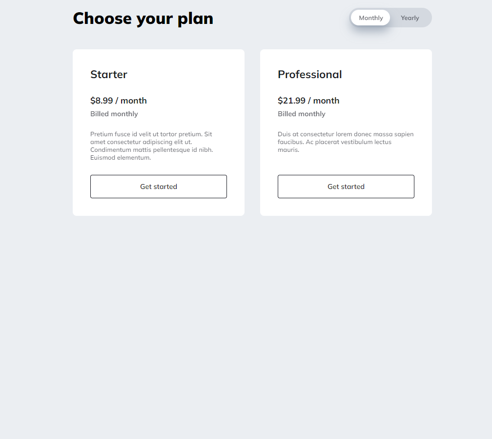

---

## 4. Project

---

## 5. Project

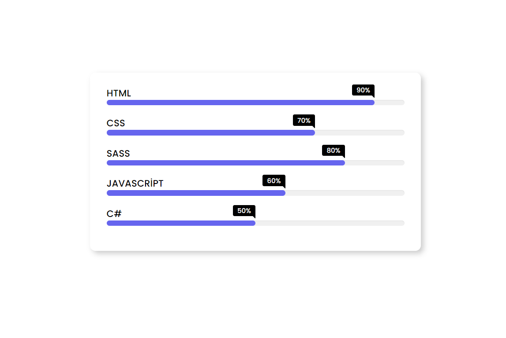

---

## 6. Project

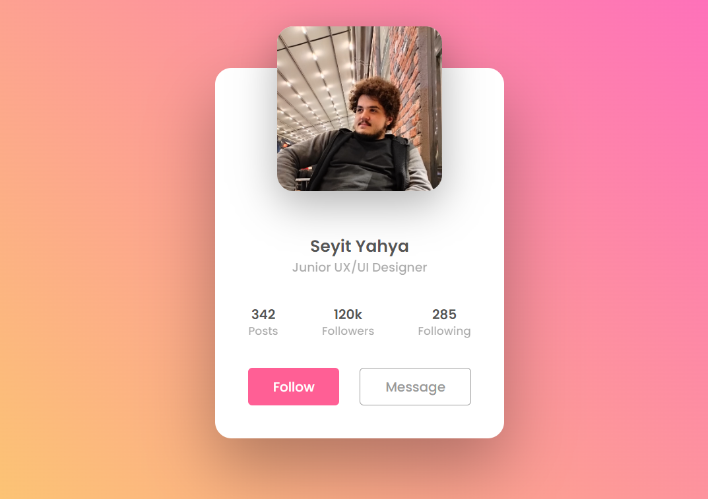

---

## 7. Project

---

## 8. Project

---

## 9. Project

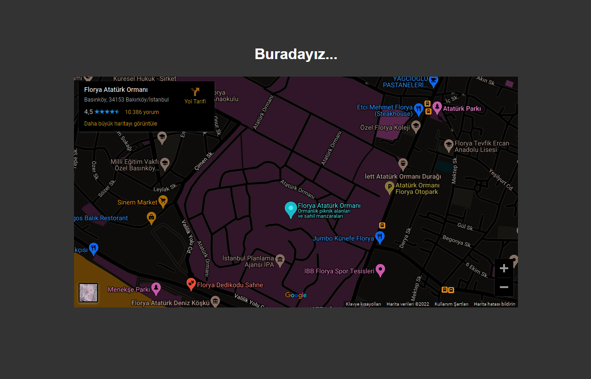

---

## 10. Project

---

## 11. Project

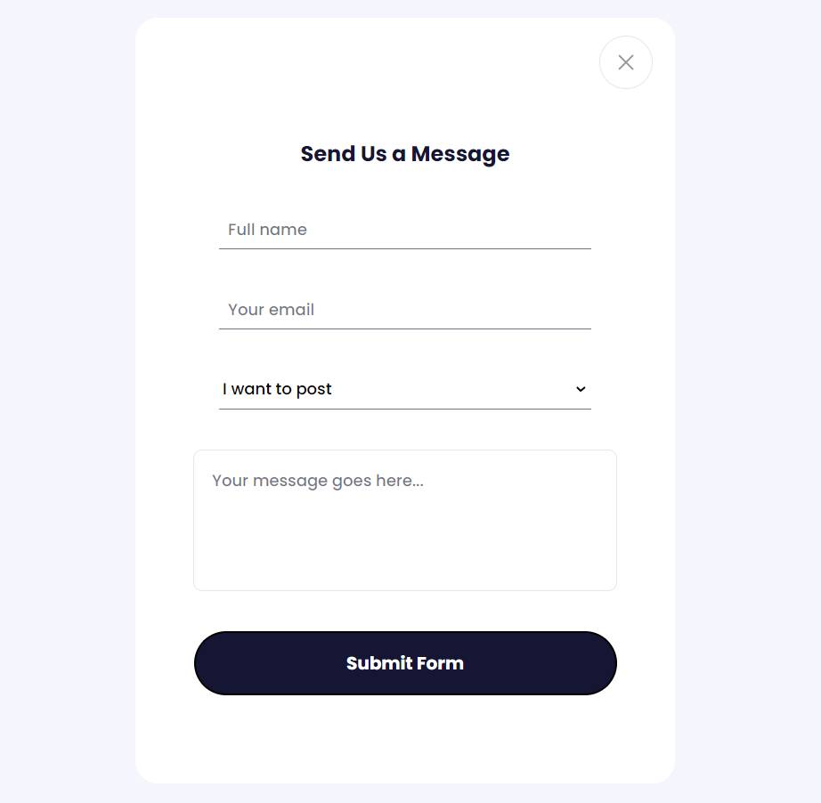

---

## 12. Project

---

## 13. Project

---

## 14. Project

---

## 15. Project

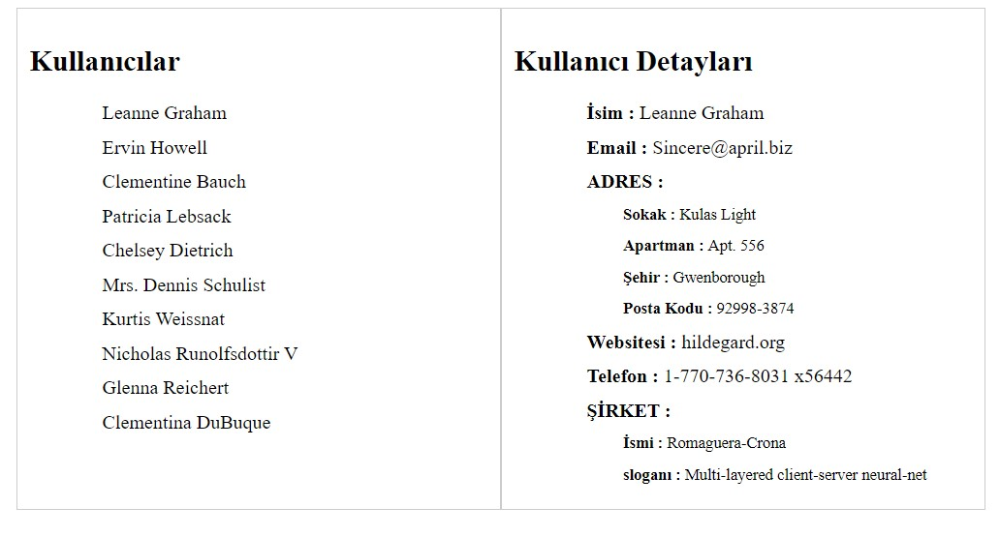

---

## 16. Project

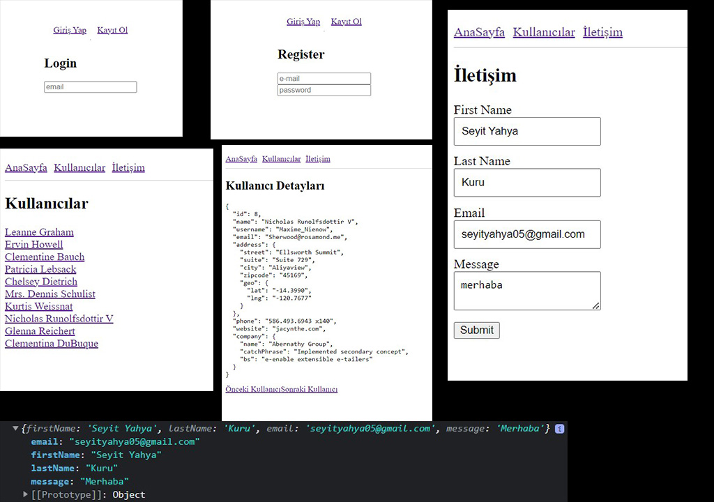

---

## 17. Project

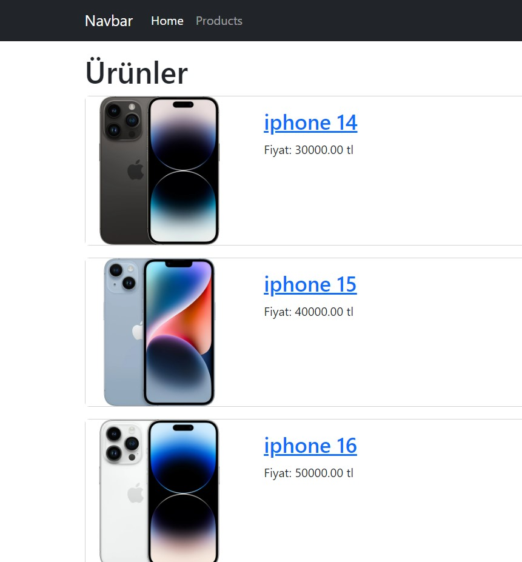

---

## 18. Project

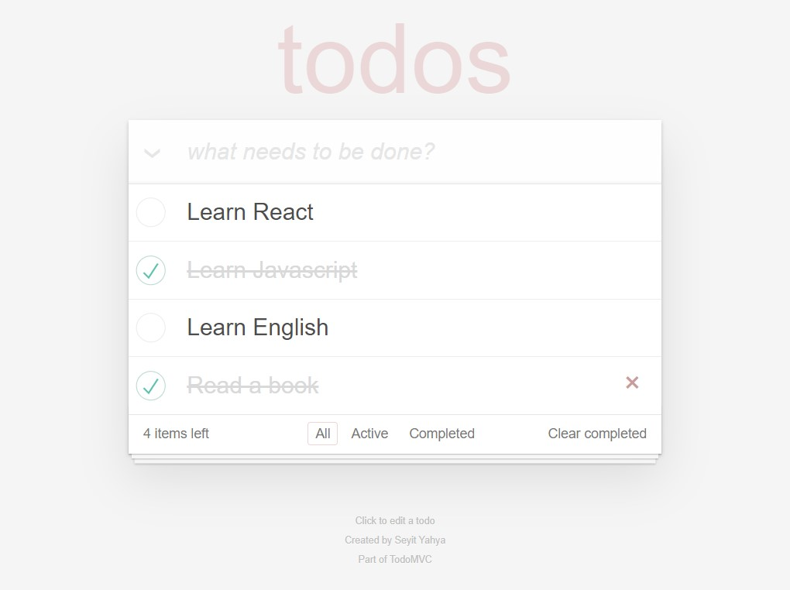
